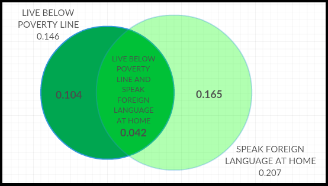

```{r setup, include=FALSE}
knitr::opts_chunk$set(echo = TRUE)
```

### 2.6 Dice rolls. 

There are 36 possible outcomes to rolling 2 dice. 

a. Getting a sum of 1 is only possible with rolling (1,1), so probability is $\frac { 1 }{ 36 }\approx0.0278$.
b. Getting a sum of 5 is only possible with rolling (1,4), (2,3), (3,2) and (4,1), so probability is $\frac { 4 }{ 36 }=\frac{1}{9}\approx0.1111$.
c. Similarly to (a), getting a sum of 12 is only possible with rolling (6,6), so probability is $\frac { 1 }{ 36 }\approx0.0278$.

### 2.8 Poverty and language.

* Below poverty line: 14.6% or 0.146
* Speak foreign language at home: 20.7% or 0.207
* Below poverty line and speak foreign language at home: 4.2% or 0.042

a. Not disjoint since there are individuals who belong to both groups.
b. Venn diagram:



c. 0.104
d. 0.104 + 0.042 + 0.165 = 0.311
e. 1 - 0.311 = 0.689
f. P(below poverty line) * P(foreign language) = 0.146 * 0.207 = 0.030222 and P(below poverty line and foreign language) = 0.042. Since probabilities are not equal, the events are dependent.

### 2.20 Assortative mating.

a. $\frac{78+19+11+23+13}{204}=\frac{144}{204}\approx0.7059$
b. $\frac{78}{114}\approx0.6842$
c. $P(male\,with\,brown\,eyes\,has\,partner\,with\,blue\,eyes)=\frac{19}{54}\approx0.3519$ and $P(male\,with\,green\,eyes\,has\,partner\,with\,blue\,eyes)=\frac{11}{36}\approx0.3056$
d. Based on parts (b) and (c), probabilities of male respondents with various eye colors having partners with blue eyes are all different. If they were independent, probabilities should be the same. Eye colors of male respondents and their partners are dependent.

### 2.30 Books on a bookshelf.

a. $\frac{28}{95}*\frac{59}{94}\approx0.185$
b. Breaking the problem into probability of drawing a hardcover fiction book followed by another hardcover book plus probability of drawig a paperback fiction book followed by hardcover book: $(\frac{13}{95}*\frac{27}{94})+(\frac{59}{95}*\frac{28}{94})=\frac{351+1652}{8930}\approx0.2243$
c. $\frac{72}{95}*\frac{28}{95}\approx0.2234$. Because the sample size of 2 book is very small comparing to the population of 95 books, the events are nearly independent even if sampling without replacement as in part (b). Probabilities are very close.

### 2.38 Baggage fees.

$i$                                       | 0        | 1       | 2        | Total
----------------------------------------- | -------- | ------- | -------- | ------
${ x }_{ i }$                             | $0       | $25     | $60      | 
$P(X={ x }_{ i })$                        | 0.54     | 0.34    | 0.12     | 
$E(X)$                                    | 0        | 8.5     | 7.2      | 15.7
${ x }_{ i }-E(X)$                        | -15.7    | 9.3     | 44.3     |
${({ x }_{ i }-E(X))}^2$                  | 246.49   | 86.49   | 1962.49  |
${({ x }_{ i }-E(X))}^2*P(X={ x }_{ i })$ | 133.1046 | 29.4066 | 235.4988 | 398.01

$E(X)=0*0.54+25*0.34+60*0.12=15.7$

* Average revenue per passenger is $15.70. 
* Variance is 398.01.
* Standard deviation is \$19.95 ($\sqrt{398.01}$).

The airline can expect to collect **\$1,884** in revenue for a flight of 120 passengers ($120*15.7$). Variance for the flight is $120*398.01=47761.2$. Standard deviation is approximately **\$218.54** ($\sqrt{47761.2}$).

This calculation assumes that all passengers are independent of one another. However, since passengers often travel in families and groups I do not believe this assumption is necessarily justified especially considering that there are other variable that probably influence this model considerably (such as origin and destination of the flight). A flight bound for Orlando probably has a large number of families with kids who may not follow this model in checking in their baggage.  

### 2.44 Income and gender.

```{r}
income <- data.frame(c("< 10","10-14","15-24","25-34","35-49",
                       "50-64","65-74","75-99","> 100"),
                     c(2.2,4.7,15.8,18.3,21.2,13.9,5.8,8.4,9.7))
colnames(income) <- c("category","percent")
barplot(income$percent, names.arg=income$category, 
        xlab="Income Category", ylab="Percent of Population")
```

a. The distribution of personal income as presented in the frequency table is bimodal with a peak at \$35,000 to \$49,999 category and then another smaller peak at \$100,000 or more category. However, income categories are not equal in size (especially the last two categories), so I believe the second peak may be false and the distribution is actually unimodal and right skewed.
b. $0.022+0.047+0.158+0.183+0.212=0.622$
c. $P(income\,under\,50,000\,and\,female)=P(income\,under\,50,000)*P(female)=0.622*0.41=0.25502$. The assumption is that income level and gender are independent events.
d. $P(income\,under\,50,000|female)=0.718$ while $P(income\,under\,50,000)=0.622$, so the probability of income being under \$50,000 is affected by the knowledge about respondent's gender. The assumption in part (c) is wrong. The events are dependent.
