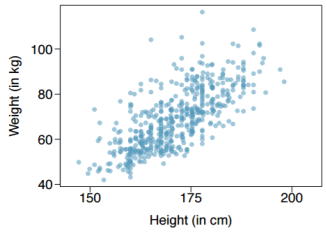

```{r setup, include=FALSE}
knitr::opts_chunk$set(echo = FALSE)
```

## 7.35 Body measurements, Part IV. {.smaller}

The scatterplot and least squares summary below show the relationship between weight measured in kilograms and height measured in centimeters of 507 physically active individuals.

<CENTER>

</CENTER>

##

**(a) Describe the relationship between height and weight.**


- Linear
- Positive
- Moderate

<CENTER>

</CENTER>

##

**(b) Write the equation of the regression line. Interpret the slope and intercept in context.**

$\widehat{weight} = -105.0113 + 1.0176 * height$

- **Slope:** For each additional cm in height, the regression line predicts the average weight to increase by 1.0176 kg
- **Intercept:** For height of 0 cm, the average weight is -105.0113

<CENTER>

</CENTER>

##

**(c) Do the data provide strong evidence that an increase in height is associated with an increase in weight? State the null and alternative hypotheses, report the p-value, and state your conclusion.**

$H_0: \beta_1 = 0$ The true slope coefficient of height is 0. 

$H_A: \beta_1 > 0$ The true slope coefficient of height is greater than 0.

The $p-value$ in the summary table is 0 (or very close to 0). This is for a two-sided test. In our case, a one-sided test, it's even lower. Therefore we reject the null hypothesis. The data provide strong evidence that an increase in height is associates with an increase in weight. 

##

**(d) The correlation coefficient for height and weight is 0.72. Calculate $R^2$ and interpret it in context.**

```{r, echo = TRUE}
R <- 0.72
R2 <- R^2
R2
```

About $R^2 = 0.5184$ or 51.84% of the variation in weight can be explained by the height. 

## Thank You